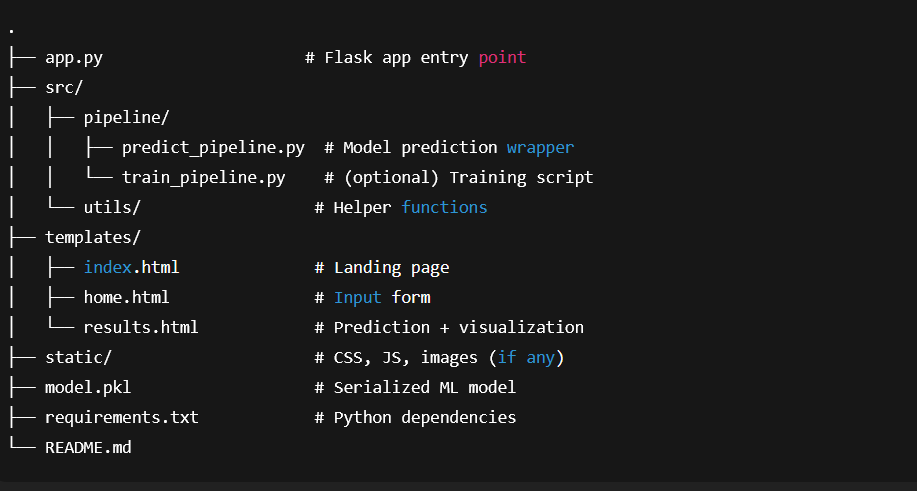
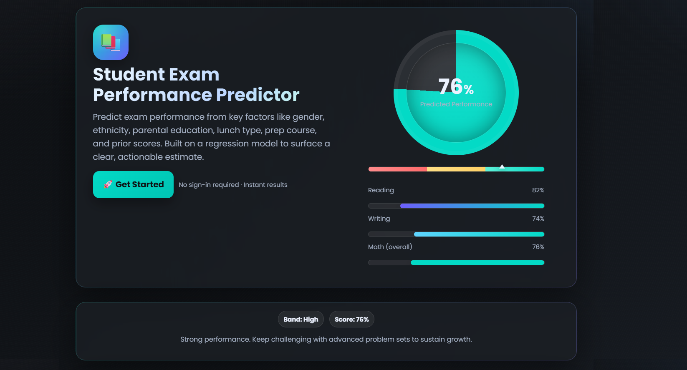
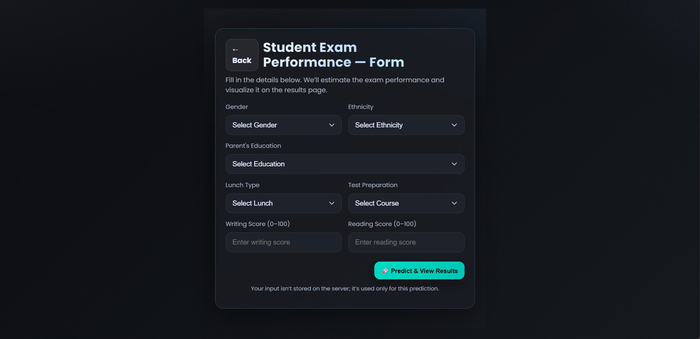
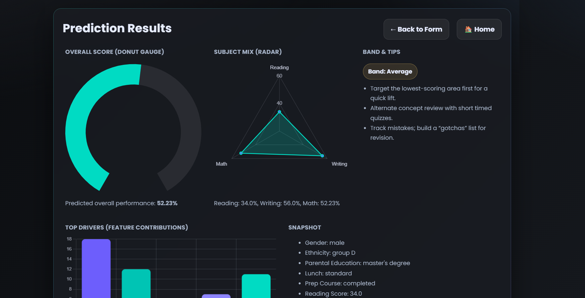

## End to End machine Learning Project
# 🎓 Student Exam Performance Predictor  

A **Flask + Machine Learning web app** that predicts student exam performance (Math & Overall) from inputs like gender, ethnicity, parental education, lunch type, prep course, and prior scores.  

---

## 📂 Project Structure  

  

---

## 🖥️ Screenshots  


### 🏠 Home Page  
  

### 📝 Input Form  
  

### 📊 Prediction Result  
  

---

## 🚀 Features  

- **Interactive form** to input student details  
- **ML prediction pipeline** built with scikit-learn  
- **Responsive UI** with gradient cards & charts  
- **Charts with Chart.js**: Donut gauge, radar, contribution bars  
- **Band indicator** (Low / Average / High) based on prediction  

---

## 🛠️ Tech Stack  

- **Backend:** Python, Flask, scikit-learn, pandas, numpy  
- **Frontend:** HTML5, CSS3, Jinja2, Chart.js  
- **Deployment-ready:** Flask server (local or cloud)  

---

## ⚡ Quick Start  

```bash
# 1. Clone the repo
git clone https://github.com/your-username/student-performance-predictor.git
cd student-performance-predictor

# 2. Create virtual environment
python -m venv venv
source venv/bin/activate  # (Linux/Mac)
venv\Scripts\activate     # (Windows)

# 3. Install dependencies
pip install -r requirements.txt

# 4. Run Flask app
python app.py
